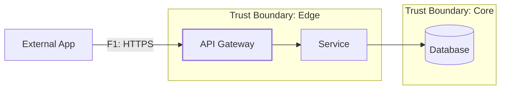

# Сниппеты — P04 (Threat Modeling)

## 1) DFD (Mermaid) — каркас с границами доверия


## 2) STRIDE — пример строки
```
| Поток/Элемент | Угроза (STRIDE) | Риск | Контроль | Ссылка на NFR | Проверка/Артефакт |
|---------------|------------------|------|----------|---------------|-------------------|
| F1 /login     | S: Spoofing      | R1   | MFA+rate-limit на /login | NFR-01, NFR-04 | e2e + ZAP baseline |
```

## 3) Реестр рисков — пример
```
| RiskID | Описание                         | Связь (F/NFR) | L | I | Risk | Стратегия | Владелец | Срок  | Критерий закрытия                 |
|--------|----------------------------------|---------------|---|---|------|-----------|----------|-------|-----------------------------------|
| R1     | Брутфорс логина                  | F1, NFR-04    | 3 | 4 | 12   | Снизить   | @owner   | 2025-10-20 | CI: rate-limit + негативные тесты |
| R2     | Утечка подробностей ошибок       | F2, NFR-02    | 2 | 5 | 10   | Снизить   | @owner   | 2025-10-25 | RFC7807 + контрактные тесты       |
```
