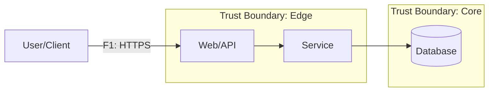

# DFD — Data Flow Diagram (шаблон)

## Диаграмма (Mermaid)

## Список потоков
| ID | Откуда → Куда | Канал/Протокол | Данные/PII | Комментарий |
|----|---------------|-----------------|------------|-------------|
| F1 | U → BFF       | HTTPS           | creds      |             |
| F2 | BFF → SVC     | mTLS            | session    |             |
| F3 | SVC → DB      | TCP             | PII        |             |
